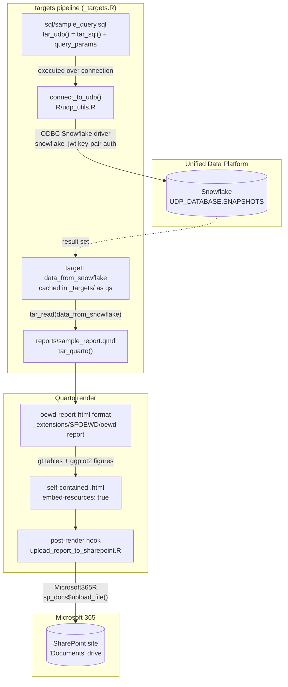

# oewd_sample_project

<!-- badges: start -->
<!-- badges: end -->

This sample project is for demonstration purposes only.

## Pipeline

### How it works

1. **Query** — `tar_udp()` (a `tar_sql()` partial carrying `query_params`) runs `sql/sample_query.sql`. The connection comes from `connect_to_udp()`, which opens an ODBC session against Snowflake using JWT key-pair auth, with server, database, warehouse, user, and private key all read from environment variables.
2. **Cache** — the result set lands in the `targets` store as the `data_from_snowflake` target, serialized with `qs`. `targets` invalidates it when the SQL file or its params change, so Snowflake is only re-queried when the query actually changes.
3. **Render** — `tar_quarto()` renders `reports/sample_report.qmd`, which pulls the cached data back in with `tar_read()`. The `oewd-report-html` extension supplies OEWD branding, SF Design System icons, and SCSS theming; `embed-resources: true` inlines everything into a single portable HTML file.
4. **Publish** — the extension's `_quarto.yml` declares a `post-render` hook, so Quarto runs `upload_report_to_sharepoint.R` immediately after a successful render. That script reads the rendered file path from `QUARTO_PROJECT_OUTPUT_FILES` and pushes it to the SharePoint `Documents` drive via `Microsoft365R`.

